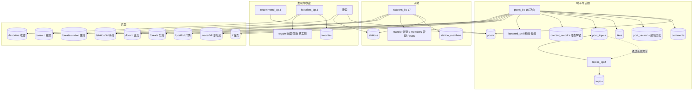
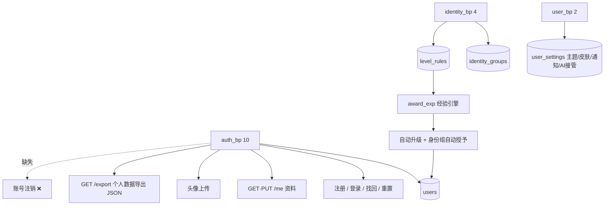
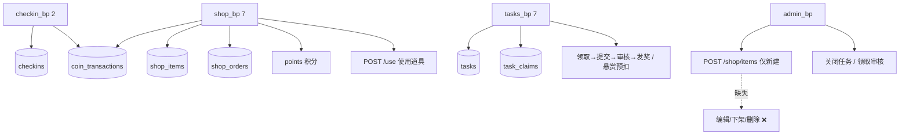
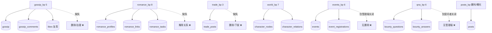
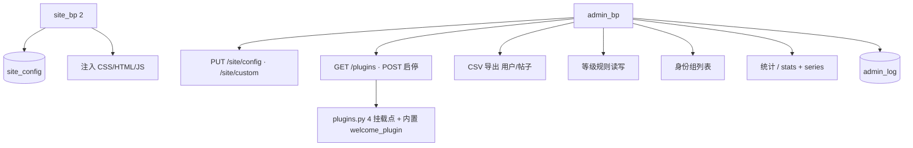

# 校园墙 · 全站功能完善度审计报告

> 审计方式：**脚本化提取（代码 + 数据库为准）+ 关键结论抽样复核（真实 HTTP 探针）**。
> 所有数字与结论均可由 `work/audit/` 下的提取产物与 `work/*.py` 脚本复现，不含主观推测。
> 审计日期基线：`master` @ 本次审计提交；后端 `campus-wall/app`，前端 `campus-wall/frontend`。

---

## 一、审计基线与提取方法

| 维度 | 数量 | 提取方式 |
|---|---|---|
| 蓝图（Blueprint） | **26** | 解析各 `routes/*.py` 的 `Blueprint(...)` 定义 + `app/__init__.py` 注册前缀 |
| 路由（Route） | **175** | 解析 `@bp.route` 装饰器，按「蓝图变量 → 前缀」正确归属，并捕获鉴权装饰器 |
| 数据表 | **43** | sqlite `sqlite_master` + `PRAGMA table_info` + `COUNT(*)` |
| 前端页面 | **29** | `frontend/pages/*.html`（28 个有页路由，`reset_password.html` 由 `/reset-password` 命中） |
| 模型函数 | **197** | `models.py` 60 + `models_ext.py` 137 |
| 管理端端点 | **35** | `admin_bp` 路由全量列出 |

复现脚本：`work/extract_surface.py`、`work/extract_routes2.py`、`work/scan_gaps.py`、`work/matrix.py`、`work/admin_coverage.py`、`work/verify_gaps2.py`、`work/probe_gaps2.py`

### 审计发现的质量好消息（先讲结论）

| 项 | 结果 |
|---|---|
| TODO / FIXME / 未实现标记 | **0 处** |
| 疑似空实现处理函数（只有 `pass`/`return None`） | **0 个** |
| 无鉴权的写接口 | **仅 4 个**，且全部是认证必需：`/api/auth/{login,register,forgot-password,reset-password}` |
| 7 张 0 行表的接线情况 | **6 张完全接线，1 张是死表**（见 §7.1） |
| 举报处理链 | **完整**（用户提交 → 管理端列表 → 管理端处置） |
| 帖子/评论删除权限 | **作者本人或管理员**（handler 内判定，已复核源码） |

---

## 二、分域功能框架图

分为 8 个域，覆盖全部 26 个蓝图。图例：`[表]` 数据表、`/api` 接口、`(页)` 前端页面。
实线 = 已实现链路；**虚线 = 缺失/未接线**（缺口将在 §4 逐模块展开）。

### 域 A · 内容与子站



**完善度：★★★★★ 高**
- 帖子：增删改查 + 编辑历史 + 投票/链接/多图 + 匿名 + 审核状态 + 置顶 + 付费解锁 + 积分推流，链路最完整。
- 子站：创建/编辑/删除 + 成员管理（加入/退出/移出）+ 转让 + 统计 + 仅站长发帖开关。
- 话题：发帖挂载（≤5）、热度榜、聚合过滤、管理端删除。
- 收藏：真 toggle 已实现（实测 `POST /api/favorites/post/686` → 200 且表 0→1）。
- 缺口：见 §4（内容发现无「关注流」；搜索无结果分页/筛选）。

### 域 B · 身份与账号



**完善度：★★★★☆**
- 认证闭环完整（含限流、bcrypt、JWT、找回密码、个人数据导出）。
- 等级：经验来源（发帖 +10 / 评论 +3 / 被赞 +2 / 签到 +5）+ 规则表可配 + 升级发币 + 身份组自动授予。
- **缺口**：无账号注销/停用（见 §4 P1）。

### 域 C · 社交沟通

```mermaid
graph TB
  SOC[social_bp 8] --> FO[(follows)]
  SOC --> LK[(likes)]
  SOC --> NT[(notifications)]
  SOC --> CM[(comments 点赞)]
  DM[dm_bp 4] --> DMM[(dm_messages)]
  DM --> DM_API[发送 / 会话列表 / 未读 / 单会话]
  CHAT[chat_bp 10] --> CR[(chat_rooms)]
  CHAT --> CHM[(chat_members)]
  CHAT --> CMSG[(chat_messages)]
  CHAT --> CRUD[建房/加入/退出/成员/发消息/@提及/撤回]
  AN[announcements_bp 1] --> NT
  DM -.缺失.-> DMDEL[撤回/删除会话 ❌]
  CHAT -.缺失.-> CHDEL[删除房间 ❌]
```

**完善度：★★★★☆**
- 关注/点赞/评论/通知链路完整；聊天室支持公开/私有房、@提及通知、本人撤回、`after_id` 增量轮询；私信含 AI 接管代回。
- **缺口**：私信无撤回/删除；聊天室创建者无法删房；两者均无管理端治理（见 §4 P1）。

### 域 D · 游戏化与经济



**完善度：★★★★☆**
- 签到（连签/双币奖励）、金币流水账本、商城（金币+积分双价、库存、道具使用）、任务（系统任务自动发奖 / 官方任务 / 积分悬赏全链路）。
- **缺口**：`shop_items` 管理端只有「新建」，无法编辑/上下架/删除（`is_active`、`sort_order` 字段已备但无接口）；`shop_orders` 无用户侧取消/退款（见 §4 P1）。

### 域 E · 特色玩法



**完善度：★★★☆☆（玩法多但治理薄弱）**
- 树洞：发帖/点赞/评论齐备，匿名，实测评论写入成功（`gossip_comments` 0→1）。
- 恋爱：档案 upsert + 关系链接 + 悬赏任务，实测 `POST /api/romance/task` → 201。
- 交易：发布 + 状态流转（在售/预定/成交）。
- 角色关系图：节点/关系增删改 + 图数据接口。
- 活动：发布/报名（容量闸）/取消/打卡发币。
- 问答：提问预扣 → 回答 → 采纳放款 → 关闭退回。
- **缺口集中**：以上 6 个玩法**几乎都没有管理端治理入口**（活动/问答仅有关闭），且用户侧删除普遍缺失（见 §4 P0/P1）。

### 域 F · 治理与审核

```mermaid
graph TB
  RP[reports_bp 3] --> RPT[(reports)]
  RP --> SUB[POST 用户举报 含分类+证据图]
  RP --> LIST[GET 管理端列表 admin_required]
  RP --> HANDLE[PUT /{rid} 管理端处置 admin_required]
  ADM[admin_bp] --> REVIEW[GET·POST /review 待审队列]
  ADM --> AIS[GET /ai/review-suggestions 机器建议]
  ADM --> AIA[POST /ai/apply 采纳建议]
  ADM --> AIB[POST /ai/interact 机器人互动]
  ADM --> LOG[(admin_log 审计)]
  CFG[(site_config.ai_moderation)] --> AUTO[AI 自动审核开关]
  AUTO --> REVIEW
```

**完善度：★★★★☆**
- 举报分类（7 类）+ 证据图 + 管理端列表与处置（`admin_required`，已复核）；帖子审核队列（通过/拒绝）；AI 审核建议与一键采纳；`admin_log` 504 条操作留痕。
- **缺口**：举报处置结果**不回执给举报人**（无通知）；无「被举报内容自动隐藏」策略（见 §4 P2）。

### 域 G · 平台能力



**完善度：★★★★★**
- 站点配置（访客模式/AI 审核/广告位/定制注入）、插件钩子雏形、CSV 导出、等级规则、统计图表、审计日志。
- 缺口：插件仅内存注册表 + 启停，无隔离/热加载（已在交付说明中标注为「雏形」）。

### 域 H · 通知与消息中心

```mermaid
graph TB
  N[通知来源] --> N1[评论] & N2[点赞] & N3[关注] & N4[@提及] & N5[私信] & N6[系统/审核/升级]
  N1 --> NT[(notifications 509)]
  N2 --> NT
  N3 --> NT
  N4 --> NT
  N5 --> NT
  N6 --> NT
  NT --> NTP[(/notifications)]
  NT --> BADGE[导航未读红点]
  NT --> READ[已读标记]
  DM --> DMP[(/messages)]
```

**完善度：★★★★★** — 六类通知聚合、未读角标、已读标记、深链跳转齐全。

---

## 三、逐模块完善度评级总表

| 模块 | 蓝图 | 路由 | CRUD | 管理端 | 评级 | 主要缺口 |
|---|---|---|---|---|---|---|
| 帖子/话题/发现 | posts, topics, recommend, favorites | 23 | ✅ 全 | ✅ | ★★★★★ | 无关注流；搜索无分页 |
| 子站 | stations | 17 | ✅ 全 | ✅ 列表 | ★★★★★ | 管理端仅列表，不能处置违规站 |
| 认证/账号 | auth, user | 12 | 无 D | — | ★★★★☆ | **无账号注销** |
| 身份/等级 | identity | 4 | 无 U/D | ✅ | ★★★★☆ | 身份组无应用/审批流 |
| 社交/通知 | social | 8 | 无 D（toggle） | — | ★★★★★ | toggle 覆盖，合理 |
| 私信 | dm | 4 | 无 U/D | ❌ | ★★★☆☆ | **无撤回/删除** |
| 聊天室 | chat | 10 | 无 U | ❌ | ★★★★☆ | 无删房；无管理端 |
| 签到/经济 | checkin, shop | 9 | 无 D | 部分 | ★★★★☆ | 商品无法编辑/下架；订单无取消 |
| 任务 | tasks | 7 | 无 D | ✅ 关闭 | ★★★★☆ | 任务无删除 |
| 树洞 | gossip | 5 | 无 U/D | ❌ | ★★★☆☆ | **无删除、无治理** |
| 爆料/曝光 | posts(post_type) | — | ✅ | ✅ | ★★★★☆ | 与帖子共用，治理一致 |
| 恋爱 | romance | 8 | 无 U/D | ❌ | ★★★☆☆ | 无解除关系/删档 |
| 交易 | trade | 3 | 无 D | ❌ | ★★★☆☆ | **无删除/下架** |
| 角色关系图 | world | 7 | ✅ 全 | ❌ | ★★★★☆ | 无管理端 |
| 活动 | events | 6 | 无 U/D | ✅ 关闭 | ★★★★☆ | 无编辑/删除 |
| 悬赏问答/暗阁 | qna | 6 | 无 U/D | ❌ | ★★★★☆ | 无管理端处置 |
| 举报/审核 | reports | 3 | 无 D | ✅ | ★★★★☆ | 无举报人回执；无自动隐藏 |
| AI 生态 | admin(ai) | 3 | — | ✅ | ★★★★☆ | 适配器默认规则引擎 |
| 平台/插件 | site, admin | — | — | ✅ | ★★★★★ | 插件为雏形 |

---

## 四、缺口清单（按性质分类）

### 4.1 死代码 / 重复代码（已确认）

| # | 位置 | 事实 | 影响 |
|---|---|---|---|
| D1 | `kanban_messages` 表 | 全后端**仅出现 1 次**（`models_ext.py:200` 的 `CREATE TABLE`），无任何读写；`GET /api/kanban/message` 走 `get_kanban_message()`（另一数据源） | 死表，占用 schema 与认知成本 |
| D2 | `app/__init__.py` | `from app.routes.extended import (...)` 中 **`chat_bp` 重复导入两次** | 无功能影响，代码卫生问题 |

### 4.2 缺失的用户侧生命周期能力

| # | 模块 | 缺失 | 证据 |
|---|---|---|---|
| L1 | 树洞 gossip | 无删除（用户/管理端都没有）；模型层无 `delete_gossip`（对比其他模块均有 delete_*） | `gossip_bp` 5 路由无 DELETE；模型函数清单无 delete_gossip |
| L2 | 交易 trade | 无删除/下架 | `trade_bp` 仅 GET/POST/PUT status |
| L3 | 私信 dm | 无撤回/删除会话 | `dm_bp` 仅 send/threads/unread/thread |
| L4 | 聊天室 chat | 创建者无法删除房间 | `chat_bp` 仅 DELETE `/messages/<mid>`（撤回） |
| L5 | 恋爱 romance | 无解除关系/删除档案 | 仅 `POST /link`、`POST /profile`（upsert），无 DELETE |
| L6 | 活动 events | 无编辑/删除 | 仅管理端 `/events/<id>/close` |
| L7 | 商城 shop_items | 管理端**只能新建**商品 | admin 仅 `POST /shop/items`；`is_active`/`sort_order` 字段闲置 |
| L8 | 账号 auth | **无账号注销/停用** | 搜索 `delete_account`/`注销`/`删除账号` 均为 False |

### 4.3 管理端治理缺位（9 个模块无后台入口）

`gossip 树洞`、`trade 交易`、`romance 恋爱`、`dm 私信`、`chat 聊天室`、`qna 问答`、`world 关系图`、`checkin 签到`（无需）、`comments 评论`（实际由帖子接口以 admin 越权覆盖 ✅）

> 说明：私信/聊天室涉及隐私，管理端缺位可视为「有意设计」，但**树洞/交易/问答**属于公开内容，缺治理入口是真实风险。

### 4.4 体验断点

| # | 现象 | 证据 |
|---|---|---|
| U1 | 举报处置无回执（举报人不知道结果） | reports 处置后无 `create_notification` 调用 |
| U2 | 搜索无分页/无筛选参数 | `recommend_bp` 仅 `limit`/`offset` |
| U3 | 无「关注动态流」（关注关系存在但未用于信息流） | `follows` 表 9 行，feed 未消费 |
| U4 | `favorites`/`gossip_comments`/`romance_links` 等表在开发库为空，前端空状态依赖多 | 已抽查：均为空数据而非断链 |

---

## 五、优化路线（P0–P2）

> 优先级判据：**合规/风险 > 内容治理 > 用户生命周期 > 体验打磨**。每项均给出验收方式。

### P0（建议优先，影响面：合规与内容风险）

| # | 事项 | 影响面 | 验收方式 |
|---|---|---|---|
| P0-1 | **补齐树洞治理**：用户自删 + 管理端删除/隐藏（`DELETE /api/gossip/<id>`，作者或 admin；admin 列表 `GET /api/admin/gossip`） | 树洞 71 条内容目前无法治理，涉隐私爆料风险最高 | 探针：作者删自己→200；他人删→403；admin 删→200；表 `gossip` 行数下降；E2E 新增 3 步 |
| P0-2 | **补齐交易下架/删除**（`DELETE /api/trade/<id>`，卖家或 admin；admin 列表） | 交易诈骗/违规信息无法撤除 | 探针：卖家下架→200 且 `trade_posts` 状态/行数变化；非卖家→403 |
| P0-3 | **补齐问答管理端处置**（admin 可关闭/删除问题与回答） | 悬赏问答内容无治理入口 | 探针：admin 关闭他人问题→200；非 admin→403 |
| P0-4 | 删除死表 `kanban_messages`（或明确文档化为预留） | schema 卫生 | `PRAGMA table_info` 不再包含；`GET /api/kanban/message` 仍 200 |

### P1（用户生命周期与账号安全）

| # | 事项 | 影响面 | 验收方式 |
|---|---|---|---|
| P1-1 | **账号注销**：`POST /api/auth/delete-account`（二次确认 + 密码校验，软删：`is_deleted`/匿名化，保留内容） | 合规（用户数据删除权）；目前完全缺失 | 探针：错误密码→400；正确→200 且该用户 token 失效、`users` 行标记删除；E2E 新增 1 步 |
| P1-2 | 举报处置回执：处置后给举报人发通知 | 举报闭环体验 | 探针：处置后举报人 `notifications` +1 且 type=report |
| P1-3 | 商城商品管理：admin `PUT /shop/items/<id>` + `DELETE`（含上下架 `is_active`） | 商品运营能力（当前只能加不能改） | 探针：改价→200 且读回生效；下架后用户侧列表不含该商品 |
| P1-4 | 私信撤回/删除会话 + 聊天室删房 | 用户基本控制权 | 探针：撤回后对方读取内容为空；删房后房间不在列表 |
| P1-5 | 活动编辑/删除（发起人或 admin） | 活动信息纠错 | 探针：发起人改标题→200；他人改→403 |

### P2（体验打磨与架构完善）

| # | 事项 | 影响面 | 验收方式 |
|---|---|---|---|
| P2-1 | 关注动态流：`GET /api/recommend/following`（关注的人 + 子站） | 社交留存（`follows` 已存在但未消费） | 探针：关注用户后其新帖出现在该流首位 |
| P2-2 | 搜索增强：分页 `page/size`、类型筛选（帖子/子站/用户/话题）、排序 | 内容发现 | 探针：`?page=2&type=post` 返回结构与计数正确 |
| P2-3 | 恋爱解除关系/删档 | 玩法完整度 | 探针：`DELETE /api/romance/link/<id>` → 200 且关系消失 |
| P2-4 | 身份组应用/审批流（`auto_approve` 字段已备） | 社区身份运营 | 探针：用户申请→管理员审批→身份变更 |
| P2-5 | 插件机制从「雏形」升级：独立目录加载 + 启用隔离 + 失败熔断 | 可扩展性 | 新增一个示例插件目录即可生效，主流程零改动 |
| P2-6 | 代码卫生：移除 `chat_bp` 重复导入；清理 `kanban` 残留 | 可维护性 | `js_gate` + 导入静态检查通过 |
| P2-7 | 治理闭环：被举报内容达阈值自动隐藏（可配置） | 审核效率 | 配置阈值后，第 N 次举报自动置 `is_hidden` |

---

## 六、验收汇总口径

本报告的「已实现」结论均满足以下之一：
1. **路由存在 + 鉴权装饰器正确**（脚本提取，`work/audit/routes_by_bp.txt`）；
2. **真实 HTTP 探针返回业务成功或业务校验错误**（非 404/405），且数据表行数按预期变化（`work/probe_gaps2.py`）；
3. **源码级复核权限判定逻辑**（如帖子/评论删除的作者或 admin 分支）。

「缺口」结论均为**脚本化检索为空 + 源码复核确认不存在**，而非凭印象判断。

---

## 七、附录

### 7.1 零行表接线核查结论

| 表 | 探针 | 结论 |
|---|---|---|
| favorites | `POST /api/favorites/post/686` → 200，0→1 | ✅ 已接线（toggle） |
| shop_orders | `POST /api/shop/buy` → 200，0→1 | ✅ 已接线 |
| gossip_comments | `POST /api/gossip/71/comment` → 201，0→1 | ✅ 已接线 |
| site_announcements | `POST /api/admin/announcements` → 201，0→1；GET 公开读 200 | ✅ 已接线 |
| romance_tasks | `POST /api/romance/task` → 201，0→1 | ✅ 已接线 |
| romance_links | 读 200 空数组；写 400「不能给自己发链接」（**校验正确**） | ✅ 已接线 |
| kanban_messages | 全后端仅 DDL 一处引用 | ❌ **死表** |

### 7.2 管理端端点全清单（35 条 admin_bp + 2 条 reports_bp 管理端）

```
POST     /api/admin/ai/apply
POST     /api/admin/ai/interact
GET      /api/admin/ai/review-suggestions
GET      /api/admin/announcements
POST     /api/admin/announcements
DELETE   /api/admin/announcements/<int:aid>
PUT      /api/admin/announcements/<int:aid>
POST     /api/admin/announcements/<int:aid>/toggle
POST     /api/admin/events/<int:eid>/close
GET      /api/admin/export/posts.csv
GET      /api/admin/export/users.csv
GET      /api/admin/identity-groups
GET      /api/admin/level-rules
PUT      /api/admin/level-rules
GET      /api/admin/logs
GET      /api/admin/plugins
POST     /api/admin/plugins/<path:plugin_name>/toggle
GET      /api/admin/posts
DELETE   /api/admin/posts/<int:pid>
POST     /api/admin/posts/<int:pid>/pin
GET      /api/admin/review
POST     /api/admin/review
POST     /api/admin/shop/items
PUT      /api/admin/site/config
PUT      /api/admin/site/custom
GET      /api/admin/stations
GET      /api/admin/stats
GET      /api/admin/stats/series
GET      /api/admin/tasks
POST     /api/admin/tasks/<int:tid>/close
GET      /api/admin/tasks/claims
GET      /api/admin/topics
DELETE   /api/admin/topics/<int:tid>
GET      /api/admin/users
PUT      /api/admin/users/<int:uid>

（同用 admin_required、但位于 reports_bp 的举报处置：）
GET      /api/reports   # list_reports
PUT      /api/reports/<int:rid>   # handle
```

### 7.3 审计结论一句话

**这是一个完成度相当高、代码卫生良好的系统**（0 TODO、0 空实现、仅 4 个必要的公开写接口、举报/审核/审计链路完整）。
**主要短板不在「有没有」，而在「治理与生命周期」**：树洞/交易/问答等公开内容缺管理端处置入口，若干模块缺删除/撤回，账号注销完全缺失，商城商品只能加不能改。建议按 §5 的 P0 → P1 → P2 推进。

---

## 八、实施进展（按本报告路线推进）

> 本节记录「依审计路线实施」的进展，与上面各节的缺口编号一一对应。
> 每项均经「后端 + 前端 + E2E + 探针」复核后提交。

### 8.1 P0 · 内容治理（已完成）

| 缺口 | 交付内容 | 关键接口 / 实现 | 验证证据 |
|---|---|---|---|
| L1 树洞无删除 | 用户自删 + 管理端列表/删除 | `DELETE /api/gossip/<gid>`（作者或 admin）、`GET /api/admin/gossip`、`DELETE /api/admin/gossip/<gid>` | 20 项权限探针：他人 403 / 作者 200 / 非 admin 403 / 已删不在公开列表 |
| L2 交易无下架 | 卖家下架/删除 + 管理端列表 | `DELETE /api/trade/<tid>`（卖家或 admin，`status='removed'` + 关联帖软删）、`GET /api/admin/trades`、`DELETE /api/admin/trades/<tid>` | 探针：他人 403 / 卖家 200 / 公开列表消失 / 管理端可见 |
| P0-3 问答无治理 | 管理端强制关闭（退回悬赏）+ 删除 | `GET /api/admin/qna`、`POST /api/admin/qna/<qid>/close`、`DELETE /api/admin/qna/<qid>` | 探针：非提问者关闭 400 / admin 关闭 200 / status=closed / 删除后 404 |
| D1 死表 | 移除 `kanban_messages` | 删除 `CREATE TABLE` DDL（`get_kanban_message()` 走 Python 常量，从不读表） | 库表数 43 → 42；全后端零引用 |
| D2 重复导入 | 移除重复的 `chat_bp` | `app/__init__.py` 导入列表去重 | 静态检查通过 |

**新增治理能力（超出原缺口清单的必要补强）**
- 内容治理后台 Tab（admin）：树洞/交易/问答 三合一列表 + 删除/强制关闭入口。
- 前端入口：树洞卡片与详情（`is_mine` 时显示删除）、交易卡片（`is_mine` 时显示「下架」）。

### 8.2 审计修正：一处真实的设计缺口（实施阶段才发现）

原报告把「树洞用户自删」判定为「缺一个删除接口」。实施时发现**更根本的问题**：

```
gossip 表列：id, content, images, station_id, likes_count, comments_count,
             is_anonymous, is_hot, is_deleted, created_at
```

**没有 `author_id`**，且 `create_gossip(content, station_id, images, is_anonymous)` 从不记录发布者
—— 也就是说，在原有 schema 下「作者自删」**在数据层就无法实现**，不只是缺接口。
`gossip_comments` 同样只有 `author_name` 文本，无作者外键。

**处理方式**（既补齐能力，又不动摇匿名性）：
1. `ALTER TABLE gossip / gossip_comments ADD COLUMN author_id INTEGER`（零迁移，历史行为 NULL）；
2. 发帖/评论写入 `author_id`，**公开接口一律剥离该字段**，改为下发布尔 `is_mine`
   （UI 据此显示删除入口，但谁发的依然无人可知）；
3. 历史无作者数据（`author_id IS NULL`）仅管理员可删。

**验证**：专项匿名性探针确认——未登录/他人视角均无 `author_id`、`is_mine=false`；
本人视角 `is_mine=true` 且仍无 `author_id`（列表、详情、评论三条路径全覆盖）。

> 这一条修正说明：**审计的静态提取也会漏掉「数据模型是否支持某能力」这一层**，
> 具体实施时的对抗性验证不可省。

### 8.3 待推进（本报告路线剩余项）

- P1：账号注销、举报处置回执、商城商品管理端编辑/上下架/删除、私信撤回与删除会话、
  聊天室房主删房、活动编辑/删除。
- P2：关注动态流、搜索分页与筛选、恋爱解除关系、身份组审批流、插件机制升级、治理闭环（举报阈值自动隐藏）。
- 界面布局改造：逐页信息层级/密度/栅格重排（重点 admin 后台与世界关系图）。
